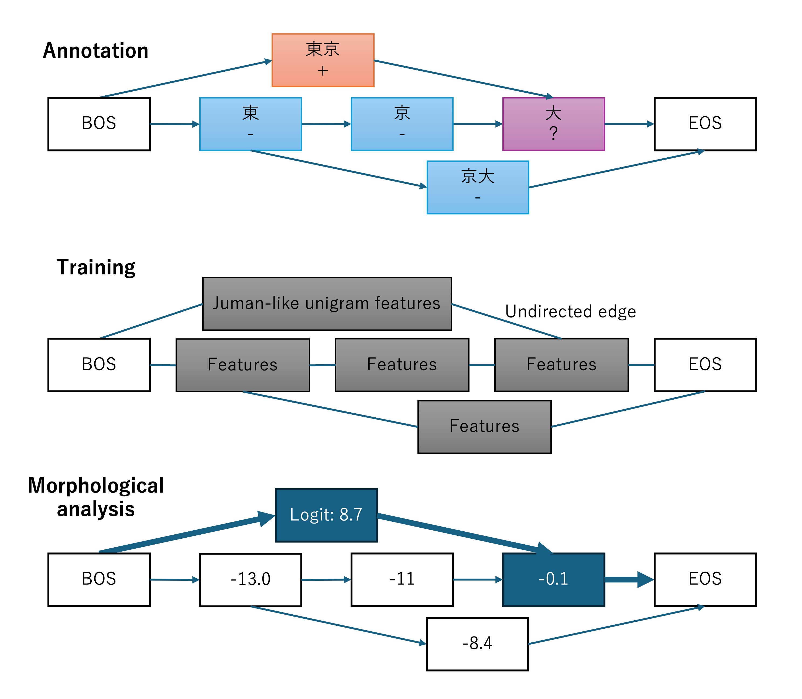

# Mecari (Japanese Morphological Analysis with Graph Neural Networks)

## Demo
You can try Mecari in https://huggingface.co/spaces/zbller/Mecari

## Overview

An unofficial implementation of Mecari [1], a GNN‑based Japanese morphological analyzer originally described by Google researchers. It supports training from partially annotated graphs (only '+'/'-' where available; '?' is ignored) and aims for fast training and inference.

<p align="center">
  
  <!-- Adjust width (e.g., 60%, 50%, or px) as desired -->
  
</p>

### Graph
The graph is built from MeCab morpheme candidates.

### Annotation
Annotations are created by matching morpheme candidates to gold labels.
Annotations serve as the training targets (supervision) during learning.
- `+`: Candidate that exactly matches the gold.
- `-`: Any other candidate that overlaps by 1+ character with a `+` candidate.
- `?`: All other candidates (ignored during training).

### Training
Nodes are featurized with JUMAN++‑style unigram features, edges are modeled as undirected (bidirectional), and a GATv2 [2] is trained on the resulting graphs.

### Inference
Use the model’s node scores and run Viterbi to search the optimal non‑overlapping path.

### Results (KWDLC test)

- Trained model (sample_model): Seg F1 0.9725, POS F1 0.9562
- MeCab (JUMANDIC) baseline:   Seg F1 0.9677, POS F1 0.9465

The GATv2 model trained with this repository (current code and `configs/gatv2.yaml`) using the official KWDLC split outperforms MeCab on both segmentation and POS accuracy.

## Environmental Setup
### Tested Environment

- OS: Ubuntu 24.04.3 LTS (Noble Numbat)
- Python: 3.11.3
- PyTorch: 2.2.2+cu121
- CUDA (runtime): 12.1 (cu121)
- MeCab (binary): 0.996
- JUMANDIC: `/var/lib/mecab/dic/juman-utf8`

### MeCab Setup (Ubuntu 24.04)
1) Install packages (includes the JUMANDIC dictionary)

```bash
sudo apt update
sudo apt install -y mecab mecab-utils libmecab-dev mecab-jumandic-utf8
```

2) Verify installation

```bash
mecab -v                       # e.g., mecab of 0.996
test -d /var/lib/mecab/dic/juman-utf8 && echo "JUMANDIC OK"
```

### Project Setup

```bash
# Install uv if needed
curl -LsSf https://astral.sh/uv/install.sh | sh

# Create venv and install dependencies
uv venv
source .venv/bin/activate
uv sync
```

## Quickstart (Morphological analysis)

```bash
# Analyze a single sentence with the bundled sample model
python infer.py --text "東京都の外国人参政権"

# Interactive mode
python infer.py

# After training, specify an experiment to use a custom model
python infer.py --experiment gatv2_YYYYMMDD_HHMMSS --text "..."
```

Note
- When no experiment is specified, the model at `sample_model/` is loaded by default.

## Train by yourself
### KWDLC Setup (Required)

```bash
cd /path/to/Mecari
git clone --depth 1 https://github.com/ku-nlp/KWDLC
```

- Training requires KWDLC (non‑KWDLC training is not supported at the moment).
- Splits strictly follow the official `dev.id` / `test.id` files.


### Preprocessing

```bash
python preprocess.py --config configs/gatv2.yaml
```

### Training

```bash
python train.py --config configs/gatv2.yaml
```

- Outputs are saved under `experiments/<name>/`.
- The bundled model was trained with the current codebase and configuration (`configs/gatv2.yaml`).

### Evaluation

```bash
python evaluate.py --max-samples 50 \
  --experiment gatv2_YYYYMMDD_HHMMSS
```


## License

CC BY‑NC 4.0 (non‑commercial use only)

## Acknowledgments
- [1] “Data processing for Japanese text‑to‑pronunciation models”, Gleb Mazovetskiy, Taku Kudo, NLP2024 Workshop on Japanese Language Resources, URL: https://jedworkshop.github.io/JLR2024/materials/b-2.pdf (pp. 19–23)
- [2] "HOW ATTENTIVE ARE GRAPH ATTENTION NETWORKS?.", Graph architecture: Brody, Shaked, Uri Alon, and Eran Yahav, 10th International Conference on Learning Representations, ICLR 2022. 2022.

## Disclaimer
- Independent academic implementation for educational and research purposes.
- Core concepts (graph‑based morpheme boundary annotation) follow the published work; implementation details and code structure are our interpretation.
- Not affiliated with, endorsed by, or connected to Google or its subsidiaries.

## Purpose
- Academic research
- Education
- Technical skill development
- Understanding of NLP techniques
